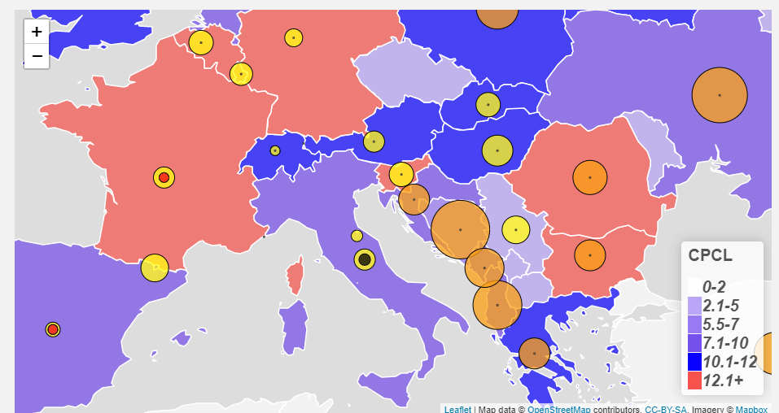
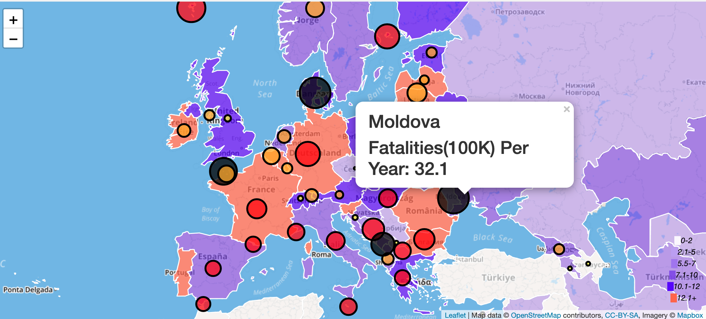
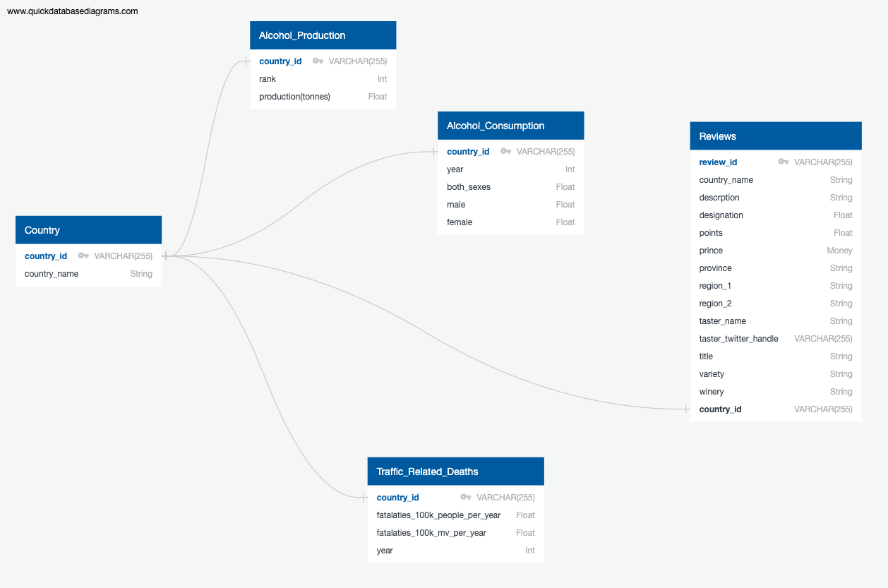

# European Alcohol Analysis

## Scope
Data exploration and visualization of alcohol consumption, alcohol production, alcohol related deaths and traffic related deaths in European countries.

The goal of the analysis is to answer the following questions:
* How does the consumption of alcohol relate to traffic accidents?
* Does the rate of alcohol production impact alcohol consumption?

## Data
* World Health Organization
* Wikipedia

## ERD Diagram of Metadata

## Observations
* Countries in Eastern Europe tend to have more traffic related deaths than Western Europe. They also consume more alcohol than other countries in the area of interest.
* Countries in Western Europe produce more alcohol than Eastern Europe.
* Italy, Spain and France are the largest wine producers in Europe (and the world).
